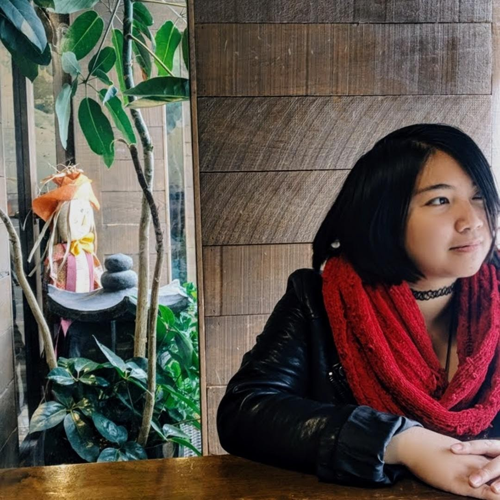
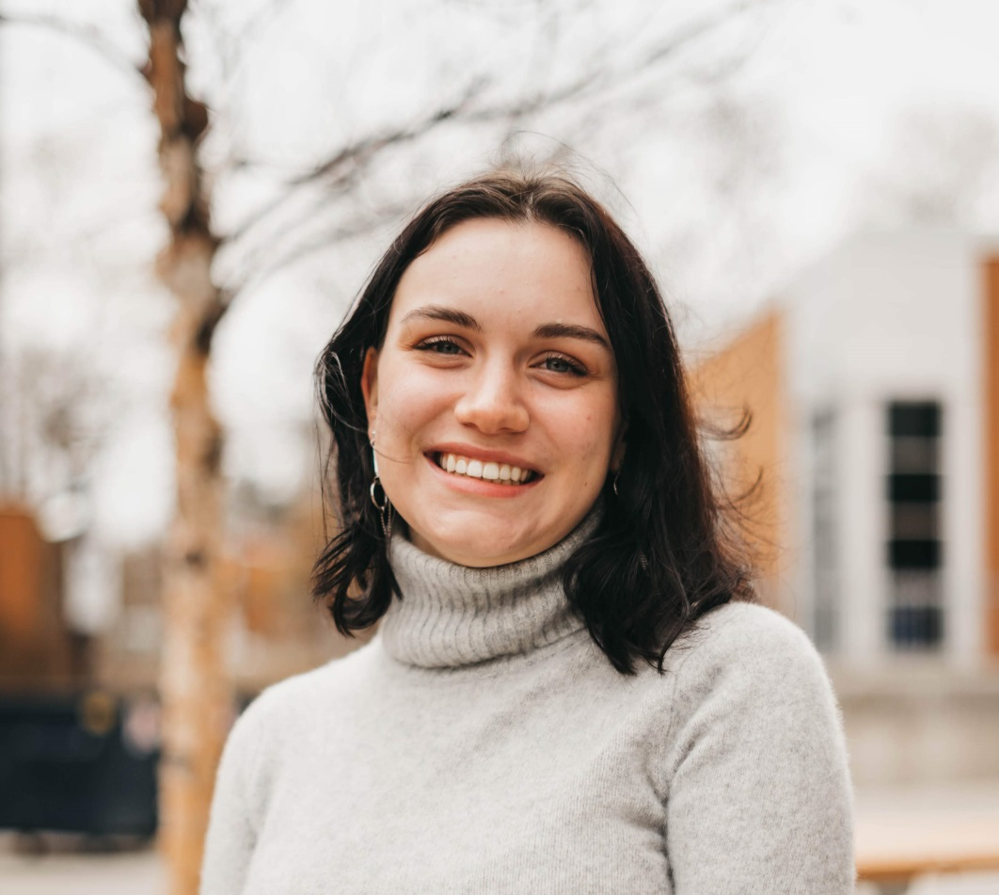

# 3G-squared

## Team Member Bios

 **Leila Denise Uy** is a 4th year undergraduate student in the GIS major with minors in Computer Science and Math at UTM. She is interested in using her skills in GIS and computer science to battle the environmental and social problems in the contemporary world. In her free time, you can find her painting, finding good dessert places with her friends, playing video
games, or making origami. 

 **Priya Patel** is a graduate student in the Department of Geography at the University of Toronto. She has a background in engineering and has previous consulting experience. Her current research is focused on modeling urban air quality using satellite remote sensing data. 

 **Nicole Moguilevskaia** is a 3rd year undergraduate student studying GIS, Computer Science, and Math at the University of Toronto. When she is not studying, she is working as a graphic designer for an on school organization empowering women in STEM called WiSC. 
