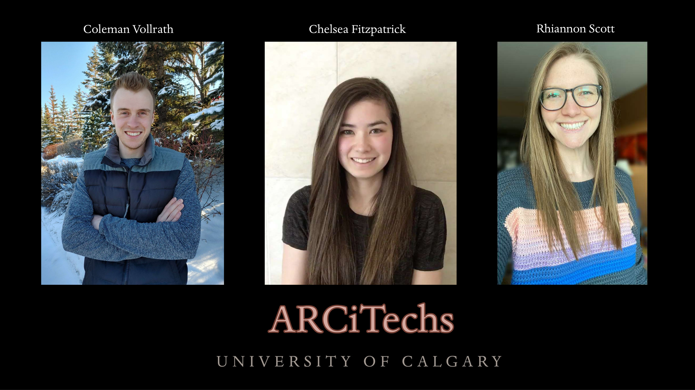

# ARCiTechs

## Team Photo

## Team Member Bios

**Rhiannon Scott**: I grew up in southern Indiana where my love and appreciation for our environment started at a young age. From playing in the creek to camping and sailing, my curiosity on how I could protect the environment grew over the years. This led me to pursue a degree in Geography and Environmental Studies with a minor in Geology from Western Kentucky University. I then pursued a career in environmental engineering where my role as an environmental scientist opened my eyes to protection management plans for construction, groundwater sampling, mold inspections, and many other projects. About a year later, I followed my heart out to Montana where I accepted a job surveying the floodplain on the Milk River. After that seasonal position ended and some time spent playing in the deep powder on the mountain I lived next to, I decided it was time to go back to school and master the world of GIS. On this new journey I hope to implement my experience I have gained over the years in a career that focuses on sustainable planning and conservation. 

**Chelsea Fitzpatrick**: I have lived in Calgary my entire life and spent a lot of my summers in the mountains. My enthusiasm for environmental conservation led me to an Environmental Science degree from the University of Calgary (U of C). During my degree I found a love for GIS and am currently pursuing a Master’s of Geographic Information Systems (MGIS) at the U of C. Working with animals has always been an aspiration of mine. I plan to use GIS in the future to protect carnivore populations, such as coyotes. My hobbies include hiking, snowshoeing, baking, and playing with my dog.

**Coleman Vollrath**: I was born and raised in Calgary and have played hockey my entire life. When I was 17, I left Calgary to play goalie for the Victoria Royals in the Western Hockey League (WHL) for four years until I was 20. Living on the island in British Columbia, my favourite pastime when I wasn’t practicing or playing was to spend time outside hiking or out on the Pacific Ocean kayaking and whale watching. Being immersed in a sensitive environment allowed me to develop a passion for environmental problem solving. In 2016/17 I started studying at the University of Calgary after my junior hockey career was finished. Last spring, I finished my undergraduate degree in Geography (BA honours), and quickly transitioned into an MSc last fall. The focus of my research is evaluating methane detection technologies and policy approaches for emissions reductions in the oil and gas sector. I use GIS to support the types of geospatial analyses my work requires and it will always be a tool I frequently use during and after my career in academia. 