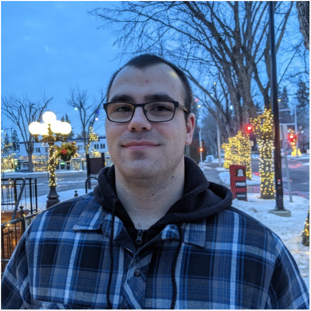

# COGS Rocky Mountain Edition

## Team Member Bios

 **Johnny Chang** is enrolled in the Advanced GIS Diploma program at COGS NSCC. He graduated from UBC in 2014 with a degree in Cognitive Systems: Computational Intelligence and Design. After working for a few years as a software developer, he is hoping to expand his skill set into the world of GIS. He believes that GIS represents a way to visualize and communicate information effectively which is and will continue to be vitally important in our increasingly information based society. In his free time, Johnny can be found flying his drone, riding his motorcycle and cooking with his partner. 

 **Nathan Wisla** loves loves the word unsolvable; when he sees a problem, you bet he's going to try his hardest to solve it. With his bachelor of science in mathematics and physics from the University of Alberta, Nathan took his problem solving abilities to a high level of abstraction, which eventually led to his passion for programming and task automation. As a kid, Nathan loved doing puzzles and looking at maps, and now that he's working towards his GIS Advanced Diploma at COGS, he has found his niche. You can catch Nathan in his spare time training in Olympic weightlifting, tinkering with Python or JavaScript, or streaming his favorite video games to Twitch. 

 **Ryan Baier** is a student taking the Advanced Diploma GIS program at COGS. He graduated from the University of Alberta with a BSc in Environmental Science and a certificate in Interdisciplinary Leadership Studies from the Peter Lougheed Leadership College. Ryan found his love for GIS when he took his first introductory course for GIS. He went on to take environmental applications of GIS and an introduction to remote sensing to expand his knowledge of GIS. After graduating and spending a year working in environmental consulting, he realized his love for working with maps and is now pursuing his dream. When he is not messing with maps, Ryan likes to play strategy games, garden, compost, and build and maintain a strong social network. 