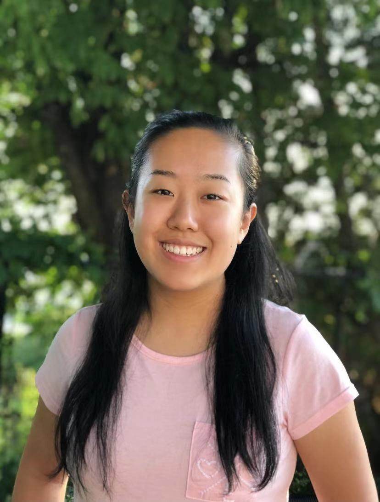

# Engeostats

## Team Member Bios

 **Ivy Liang** is a 3rd year undergraduate student at UofT studying Human Geography, Statistics and GIS. She hopes in the future to be able to further continue her interests in cities, data and geospatial technologies. In her free time, she enjoys skiing, playing the drums and listening to music! 

 **Kelly Zhu** is a 2nd year undergraduate student studying Engineering Science at the University of Toronto. She was a developer for this project and enjoys learning new things in her spare time! 