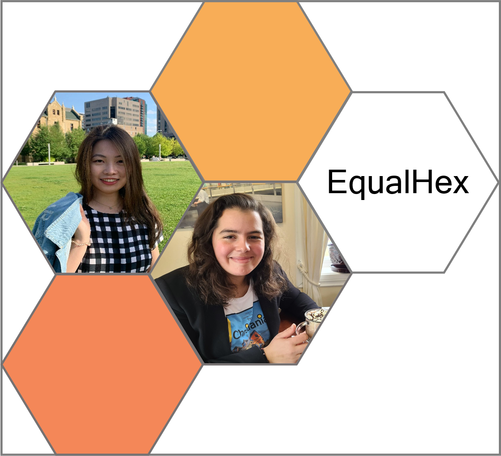

# EqualHex

## Team Photo

## Team Member Bios

**Erin Li** (left) is a second-year PhD student in the Department of Geomatics Engineering at the University of Calgary. She received her MSc in Forestry from the University of New Brunswick where she worked on the spatial analysis applied to the field of forest ecology. Her current research interests are in the usability of Discrete Global Grid Systems, especially in the digital terrain data management and geospatial operation development in Discrete Global Grids.

**Marta Padilla Ruiz** (right) is a first-year PhD student in Geomatics Engineering at the University of Calgary. She is also a Cloud Developer at Teledyne CARIS, an ocean mapping software company. She was a member of the Ocean Mapping Group at the University of New Brunswick, where she obtained her MScEng in Geodesy and Geomatics Engineering. Prior to coming to Canada, she completed a bachelor’s degree in Geomatics Engineering at the University of Jaen, and a MScEng in Topography and Geodesic Engineering at the Polytechnic University of Madrid. Her research interests are in the qualities and advantages of DGGS applied to marine geospatial data. Her professional expertise lies in Web and Cloud development, aiming to develop the new generation of Geomatics applications combining her programming and geospatial skills.