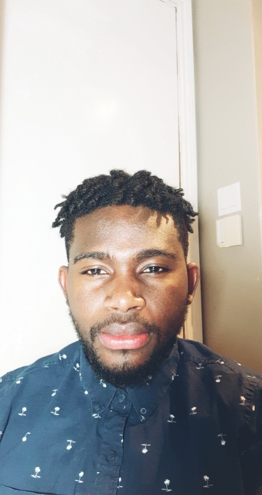
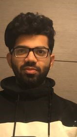

# Equimatics

## Team Member Bios

 **Giovanni Harvey**: Hi, I am Giovanni Harvey. I am in my 4th  year of Geomatics with the Computing Technology option. I enjoy developing applications and researching emerging technology. I look forward to seeing all the innovative applications built by my fellow competitors. 

 **Raghav Sethi**: Hi, I am Raghav Sethi. I am in my 4th year majoring in computational mathematics. I am very interested in applying my skillset in the GIS field and innovate solutions to interesting problems in the mapping world. 