# EqualNS 
#### A web map application to help reducing inequality of professional competence in NS

## Mission

United Nations' 2030 Agenda for Sustainable Development has listed 17 Sustainable Development Goals (SDGs) for all countries, the 10th of which being to reduce inequality.

Often than not, inequality happens systematically in long run which diminishes the ability to obtain living resources of various kinds for certain groups of people. To fight it, one should also think more about sustainable approaches.

Education or training has always been a way for people with little resources to cultivate their future and change from their current situations. However, traditional education might not be adequate, especially for those who could not access schooling in the assumed ages.

According to UN, upon hard time, some groups are more vulnerable than others to be negatively impacted. Examples are senior-aged people, children, women, and physically-challenged people.

Our GIS web app - EqualNS, aims to provide information of education and training resources for the groups mentioned above. In addition, users could also find relevant demographic and social-economic statistics that will help them to find where the most suitable education resource is.

## Features

### Provincial Minimum Wage in Chart

Minimum wage is the lowest legal wage employers can pay their employees. This chart shows the minimum wage rates in Nova Scotia dating back to 2002. 

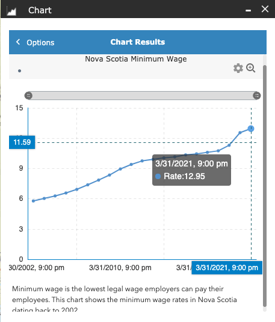

### County Demography and Employment in Pop-up

The county pop-up includes the Average Household Income in 2019, Demography and Employment.

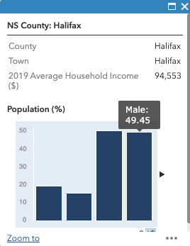 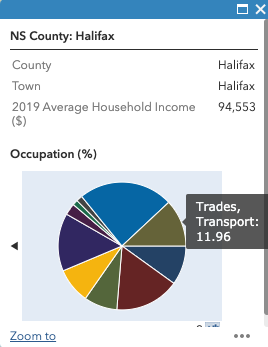

### Resource Point Layers

There are four types of resource point in this map application, the pop-up window for each resource point includes name, address and other contact informations. 

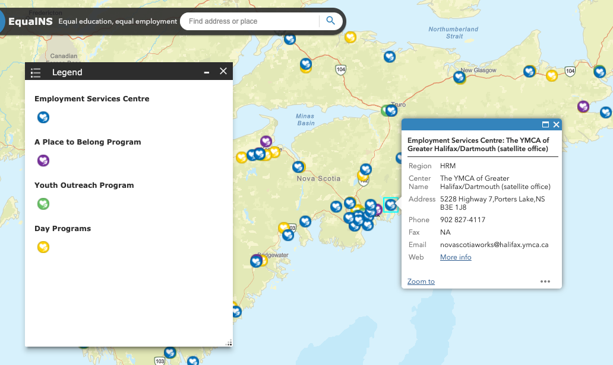

#### 1) Employment Services Centres

Locations of Nova Scotia Works Employment Services Centres.

#### 2) Day Programs

Day programs provide employment, skills training, and day program opportunities for adults with disabilities in communities across Nova Scotia. They help people with disabilities develop meaningful relationships and expand skills that increase self-reliance and independence.

#### 3) Youth Outreach Programs

The Youth Outreach program is a community-based program designed to improve the immediate and long-term social, educational/vocational, economic and health outcomes for vulnerable youth. Priority will be given to youth between the ages of 16 and 18 who are facing multiple challenges with limited supports.

#### 4) A Place to Belong Program

A Place to Belong (APTB) programs provides children and youth aged 5 to 18 with a positive after school experience that promotes their personal, social, and emotional development. These programs provide an adult-supervised environment where they can experience new opportunities, overcome barriers, build positive relationships, and develop confidence and skills for life.

### Direction function

Direction function allow users to find the direction to the destination resource point. Users can also specify the travelling method or the departure time. 

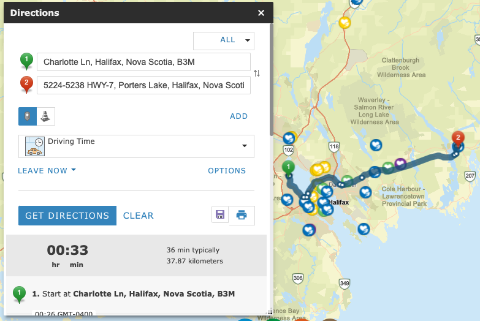

### Nearby function

Nearby function allow users to find nearby resource points within certain range. 

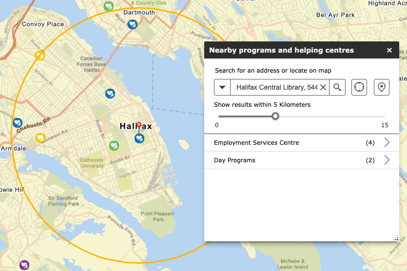

## Use instructions

### 1. Provincial Minimum Wage Chart

Step 1: Click the "chart" icon in the Anchor Bar Controller

Step 2: Select "Nova Scotia Minimim Wage"

Step 3: Click "APPLY"

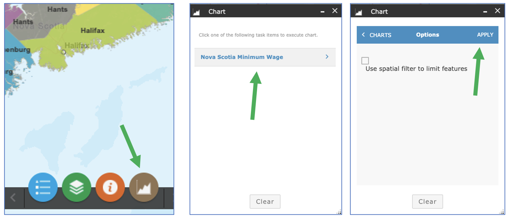

### 2. County Demography and Employment 

Click the county polygon, a pop-up will show, click the triangle right to the chart to switch between Demography and Employment.

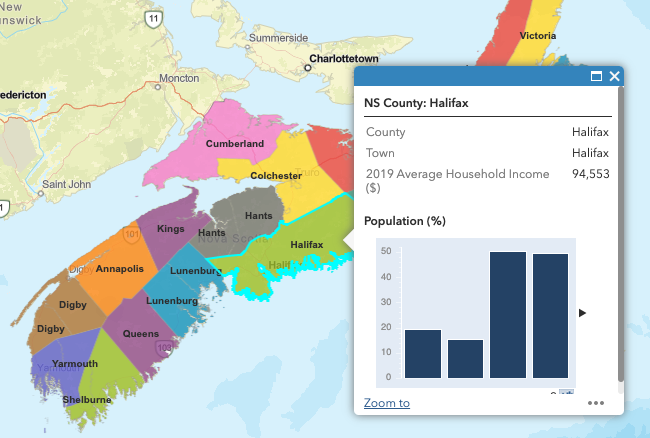

### 3. View Resource Points 

Zoom in to state/province level, four types of resource point will be displayed on the map. Click each point for the pop-up. 

### 4. Get Directions (from resource point pop-up)

Step 1: Click one of the resource point, a pop-up window is displayed

Step 2: Click the "..." at right bottom corner, and select "Directions to here"

Step 3: Specify your location or simply click "find my location"

Step 4: Click "GET DIRECTIONS"

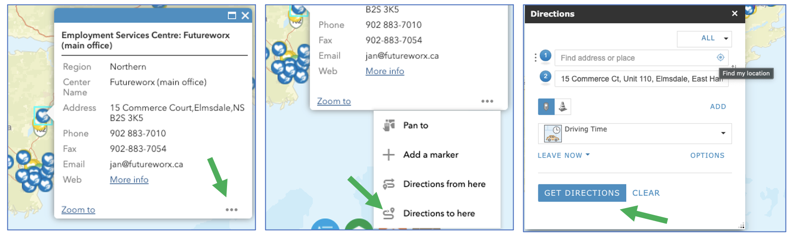

### 5. Get Directions (from Directions widget)

Step 1: Click the "Direction" widget icon at the top right corner 

Step 2: Specify the origin and destination address, or simply click "find my location", or select one point from the map

Step 3: Click "GET DIRECTIONS"

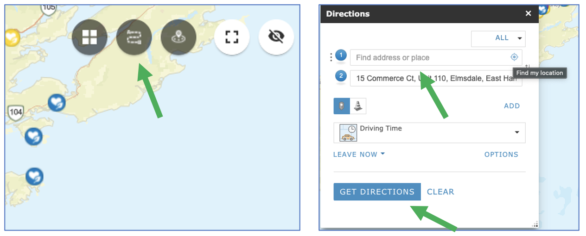

### 6. Locate Nearby Resource Points 

Step 1: Click the "NEARBY" widget icon at the top right corner 

Step 2: Specify your address or simply click "find my location"

Step 3: Specify the range 

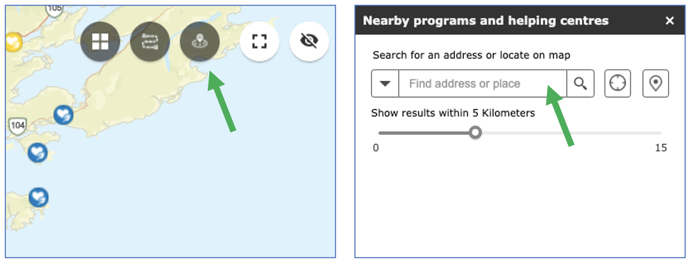

## Story Map 

A story map is created to showcase this web map application. [EqualNS](https://storymaps.arcgis.com/stories/a2e518a3ec1d444cbf067aca484ba6a1)

## Data Sources

#### 1) Provincial Minimum Wage Chart 

[Nova Scotia Minimum Wage](https://data.novascotia.ca/Employment-and-Labour/Nova-Scotia-Minimum-Wage/nwgz-2j48)

#### 2) County Demography and Employment - Business Analyst Dataset from Esri

#### 3) Resource Point 

[Nova Scotia Works Employment Services Centre Locations](https://data.novascotia.ca/Employment-and-Labour/Nova-Scotia-Works-Employment-Services-Centre-Locat/x7cs-y5zd)

[Day Program](https://data.novascotia.ca/Community-Services/Day-Programs/99u3-pv3t)

[Youth Outreach Program Location](https://data.novascotia.ca/Community-Services/Youth-Outreach-Program-Location/s6e3-fdmr)

[A Place to Belong Program](https://data.novascotia.ca/Community-Services/A-Place-to-Belong-Program/rcyb-u6kq)
 
## Reference 

[Reduce inequality within and among countries](https://sdgs.un.org/goals/goal10)

[17 Sustainable Development Goals (SDGs)](https://sdgs.un.org/goals)

