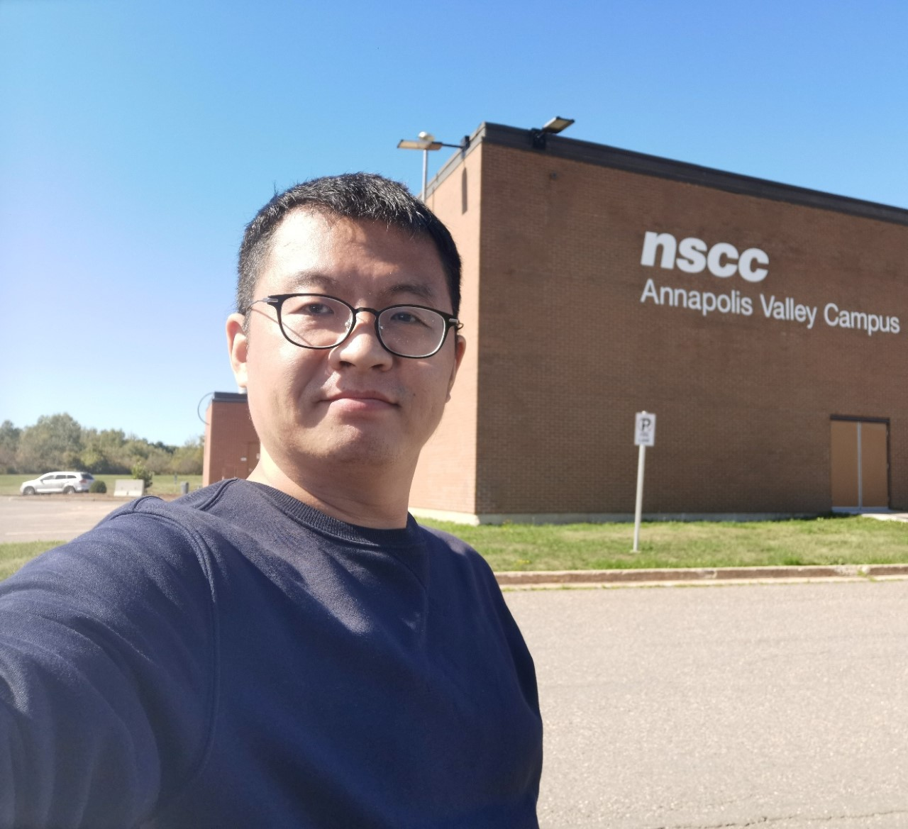
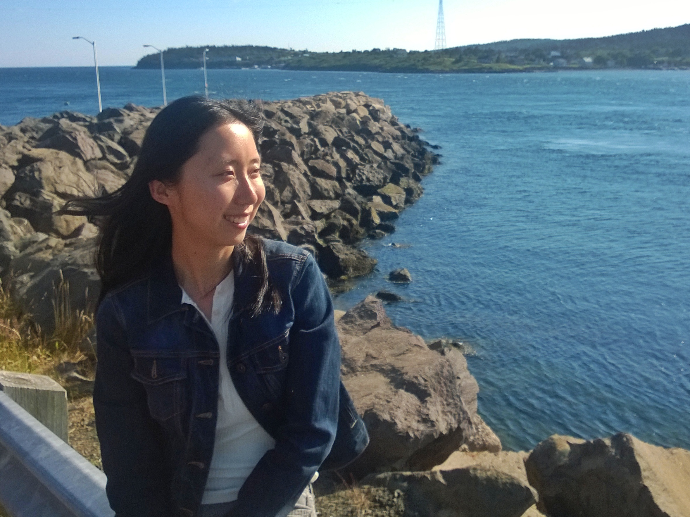

# GIS BuddY

## Team Member Bios

 **Bo Jiang**: I am studying Geospatial Data Analytics at the Centre of Geographic Sciences (COGS), NSCC. I have bachelor's degree in Computer Science (2006). Before came to Halifax, I worked in Singapore for about 12 years as software developer and system analyst. I have great passion in GIS and data analysis and enjoy solving problems using the techniques and skills I’ve learned. 

 **Xiaoyi Wang**: I am currently a student of Advanced Diploma of GIS at COGS, NSCC. Graduated with a bachelor's degree in accounting, I had worked as accountant and data technician in academic field before I was inspired by urban design and took up GIS program. 