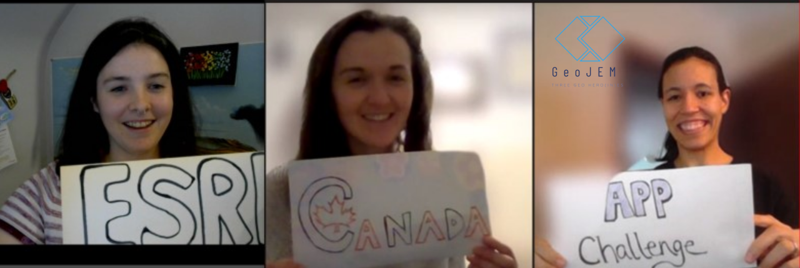

# GeoJEM

## Team Photo

## Team Member Bios

**Emily Holdsworth**: (left) I am enrolled in an Advanced Diploma in GIS at the Centre of Geographic Sciences (COGS). I also have a background in geology and environmental engineering and bed rock mapping of the Grenville Province in Southern Ontario. I believe in the power of mapping to connect us to our communities. I spend my free time playing hockey and coaching the local girls’ minor hockey league. 

**Madeline Lawler**: (centre) I am currently enrolled in the Advanced GIS Diploma at the Centre of Geographic Sciences (COGS). My background is in environmental management and commerce with a large skillset in different industries from farmers markets, non-profits, and bike shops. One of my greatest passions is using maps to navigate by bicycle and in my spare time I lead rides to help my community gain confidence by bike. 

**Juliet Goveia**: (right) I am a Geospatial Data Analytics student at the Centre of Geographic Sciences (COGS). My background is in Forestry based in British Columbia using GIS systems for navigation and mapping. I've volunteered with environmental, engineering and conservation projects in the Republic of Panama, where my family is from. The work dearest to me was with the local Girl Guides group promoting science, technology, engineering, and math. 