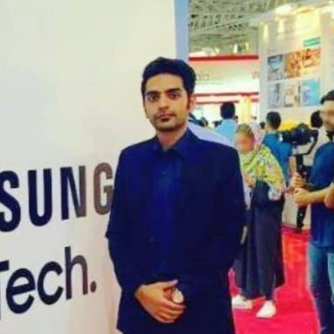
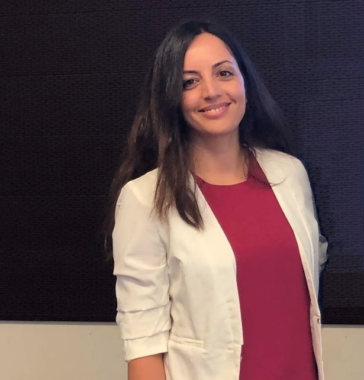
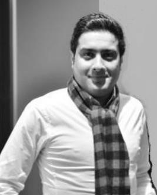

# Geo Geek Freaks

## Team Member Bios

 **Amirhossein Nourbakhshrezaei** is a PhD candidate. He is working on Quantum Computation for graph optimization problems. Experienced Computer Vision, Deep Learning, Network Analysis with a focus on Location Based Services. Skilled at Java, Python, Node.js, MongoDB. Self-motivated and determined type who always ready to face the challenges with a problem-solving manner. 

 **Sarah Kaykhosravi** is currently a fourth year PhD candidate in the Department of Civil Engineering at Lassonde, York University. Her research interest is flood management, geospatial data analysis(python), sustainable development, green infrastructure, sewer systems, hydraulic structures. Her current focus is on urban flood risk reduction using Low Impact Development (LID) techniques. 

 **Hamid Kiavarz** is a doctor of geomatics (PHD), his research interest is in field of GIS-studies , location intelligence, machine learning, deep learning, smart city, and Geo-BIM. 