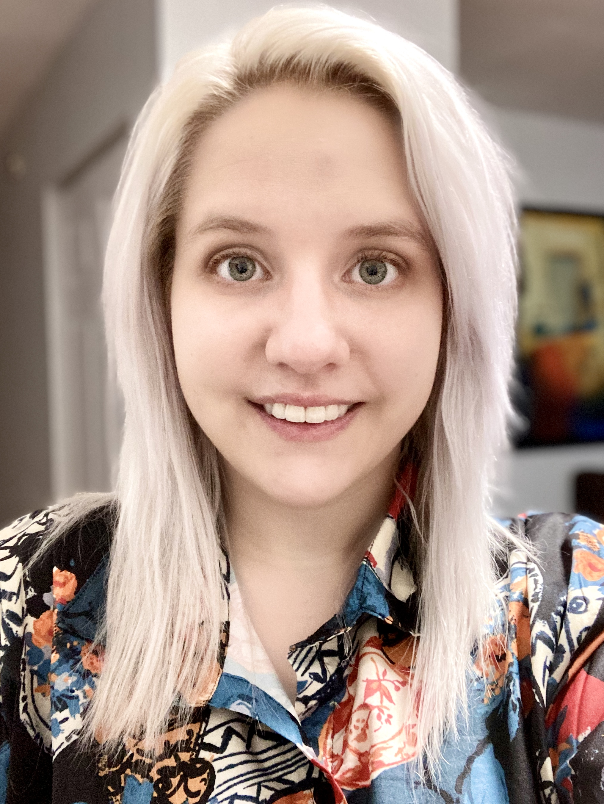
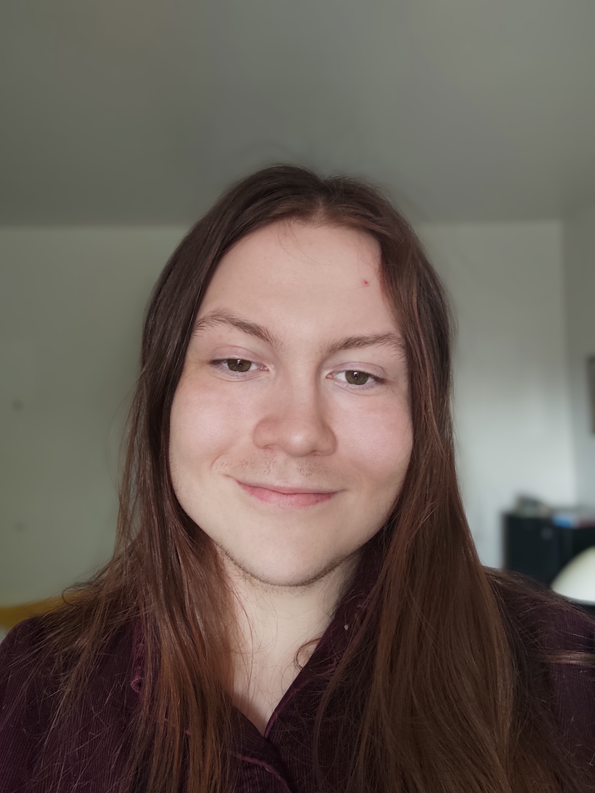

# Geography Is Where It's At

## Team Member Bios

 **Lili Smolinski**: Originating from Michigan, I am currently in my third year of Earth Science studies at Dalhousie University. I am interested in using my skills to help advance communities and provide a unique perspective on accessibility and inclusion. This challenge has been an exciting opportunity to learn to work with open data and ESRI software. 

 **Erin Hilliard** I am a second year Earth Science student at Dalhousie University. I was born and raised in Yukon Territory, and have a strong interest in geology and mineral exploration. In my community, citizens of the Tr’ondek Hwech’in First Nation account for more than half of the population and being educated in traditional knowledge as I grew up has undoubtedly made a significant impact on who I am today. As a result, I am passionate about the inequalities on reserves, and wish to utilize my knowledge and skills to investigate the true extent of disparity between Indigenous communities and the rest of Canada. 
