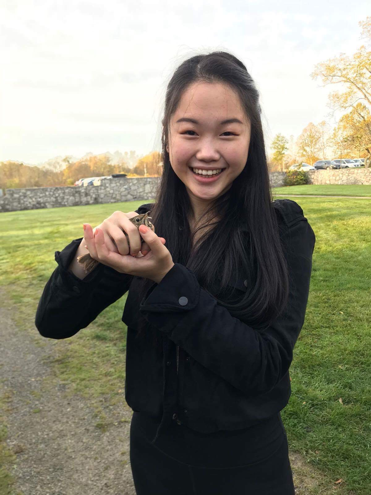
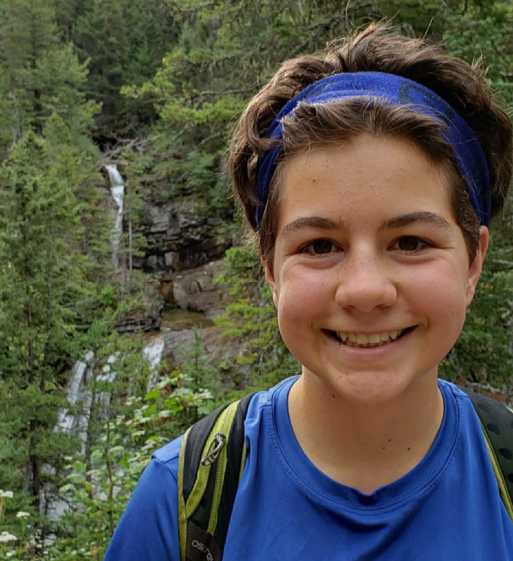

# Mac n Cheese

## Team Member Bios

 **Sherry Chen**: I am a first year Masters student studying the effects of changing water levels in coastal wetlands as well as bridging the gap between science and the community. I am currently working on an atlas for Georgian Bay wetlands using the ArcGIS Hub. I enjoy cooking and making bubble tea. 

 **Emma Sherwood**: I am a first year Masters student at McMaster University. My research involves mapping peat smouldering vulnerability based on ecohydrology using machine learning. I did my undergrad at UBC, during which time I worked on various GIS-related projects including looking at the impacts of climate change on bird diversity in northern Saskatchewan, caribou habitat disturbance in BC, and Horned Lark ecology in the southern Alberta prairies. Outside of academics, I am an avid orienteer, so I also spend my spare time with a map: orienteering is a sport where you run through the forest navigating between checkpoints using a map and compass. 

 **Raj Ubhi**: I am a second year Masters student at McMaster University. I work at the Transportation Research Lab where my research focuses on improving cyclist safety and better understanding cyclist behaviour using ArcGIS. This involves automating workflows using python and R to quickly process and analyze large GPS datasets. I did my undergrad at McMaster also, working on multiple GIS-related projects for different faculties throughout the years. Away from school, I enjoy spending time with family, playing soccer, and going on hikes - nothing like hiking next to a waterfall in Hamilton! 