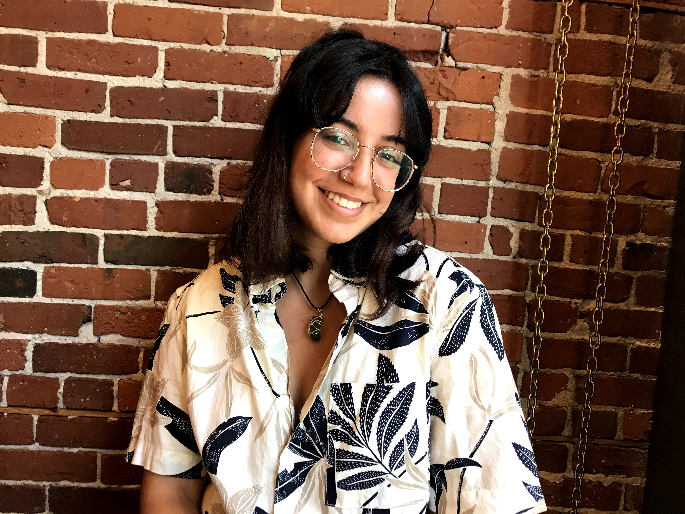

# McRaster

## Team Member Bios

 **Madinakhon (Madina) Sulaymonova**: I am currently an ECCE Student Associate and in my third year of Honours Environmental Sciences Co-op. I am on a track to attain a Certified GIS Professional (GISP) accreditation, by which I plan on carrying out my interest in GIS with my passion in epidemiology. My hobbies include HIIT workouts, playing APEX Legends, and spending time with my two year old hamster. Mom of two plants. 

 **Angelina Abi Daoud**: I am a fourth year Earth and Environmental Science student, also pursuing a Certificate of Geographic Information Science. I am starting my Master’s of Sedimentology in the Fall and hope to incorporate GIS into my research on coastal systems. My interests include owning way too many plants, raising way too many hamsters, and hiking. 

 **Olivia Maddigan**: I am a third year Geography and Environmental Sciences student currently in co-op, working as a GIS Technician. I am extremely passionate about using technology to help better our environment and hope to use this challenge as an opportunity to pursue that. My hobbies include reading obscure Wikipedia pages, shooting hoops, and playing with my 3 month old kitten. 