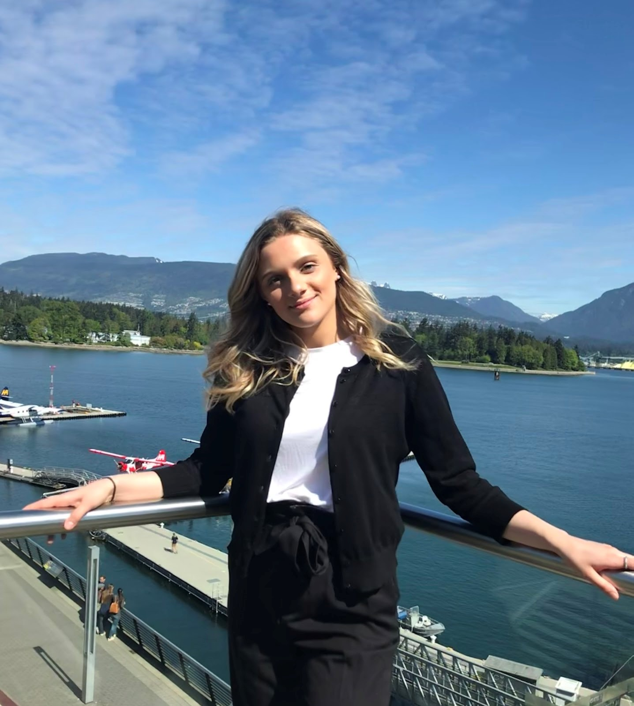
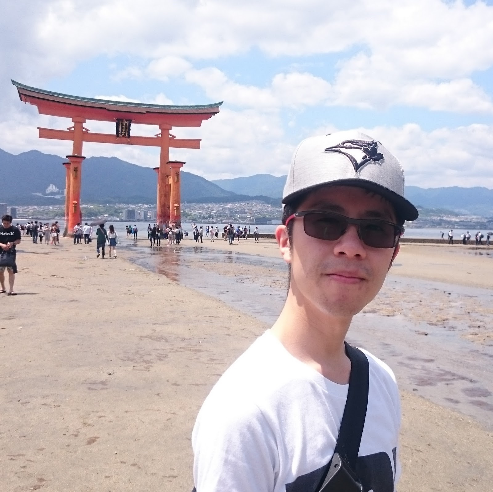
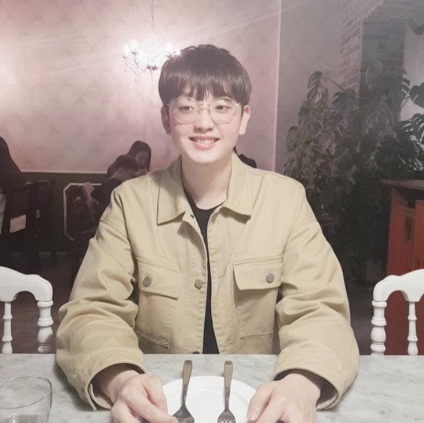

# M.U.G. (Mustang Undergraduate Geographers)

## Team Member Bios

 **Caitlyn North**: I am currently in my third year at Western University studying Geography. This is my first year as a part of the ECCE team and first time participating in the app challenge. I love to use GIS to solve real world problems so this app challenge is right up my alley. I'm excited to see what all the teams come up with! 

 **Stanley Ho**: I am currently in my fourth year at Western University with honours specialization in Political Science and major in Geography. I will continue my education at Western Geography as a MSc student in Fall 2021. As a first time participant in the ECCE app challenge, I anticipate to work with my team members to solve some real world issues with our skills! 

 **Jihaeng Lee**: Hi! My name is Jihaeng and I am from Seoul, Korea. I am currently in my 4th year of Honours Specialization in Geography and Environment and Commercial Aviation Management at Western University. This is my first time participating in the ECCE App Challenge. I am excited for this opportunity and I look forward to learning more about Esri's applications. 