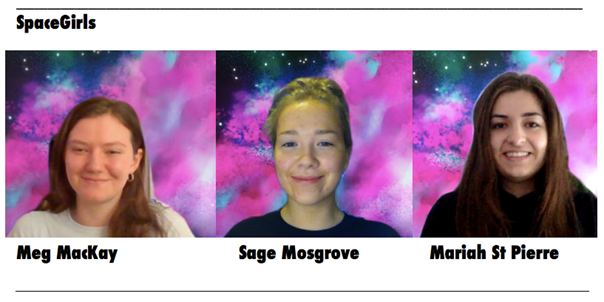

# SpaceGirls

## Team Photo

## Team Member Bios

**Meg MacKay** is a fifth-year student at Dalhousie University, majoring in environmental science. Meg spent her undergrad learning about some of her varied interests (and switching programs a couple times!), from journalism, to sustainability, to geography. She has got a new-found passion for spatial information and is especially interested in how geographic information science and technology can be used to look at social and environmental issues. This year’s theme for the ESRI App Challenge allowed her to explore just that!

**Sage Mosgrove** is a 4th year undergraduate student from Dalhousie University, studying environmental science and economics. She is an interdisciplinary student with interests in food system sustainability, ecological economics, and geographic information science. After graduation, Sage hopes to have a relaxing summer before taking on a research-based Master of Environmental Studies Degree, using her GIS knowledge to address issues of food system sustainability and development in Canada.
     
**Mariah St Pierre** is a fifth-year student at Dalhousie University working towards a BSc in Environmental Science, a minor in Statistics, certificates in GIS and EIA with co-op option. She has grown her 