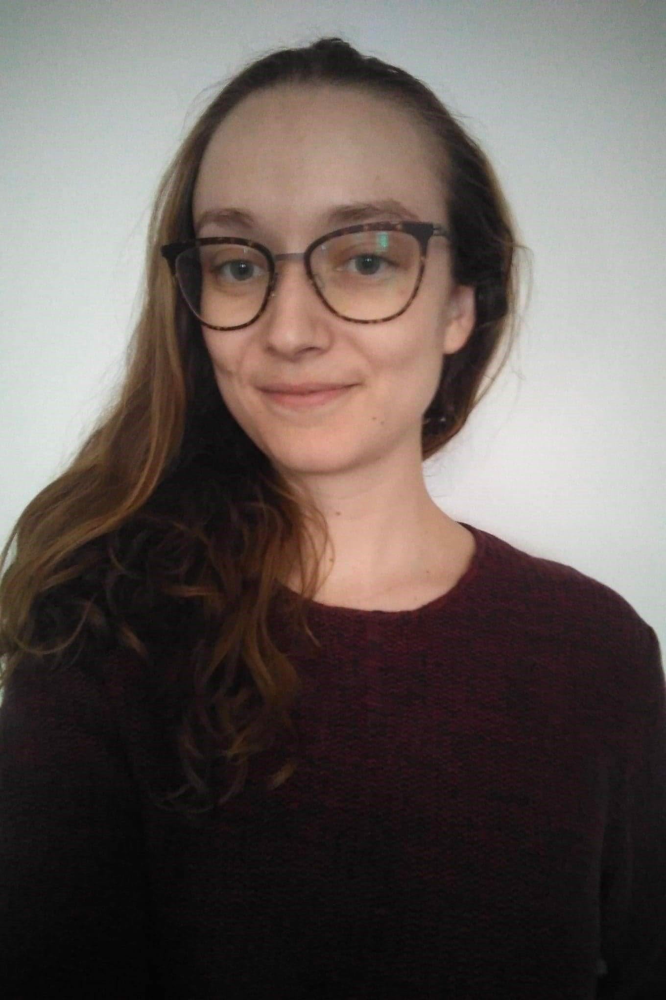
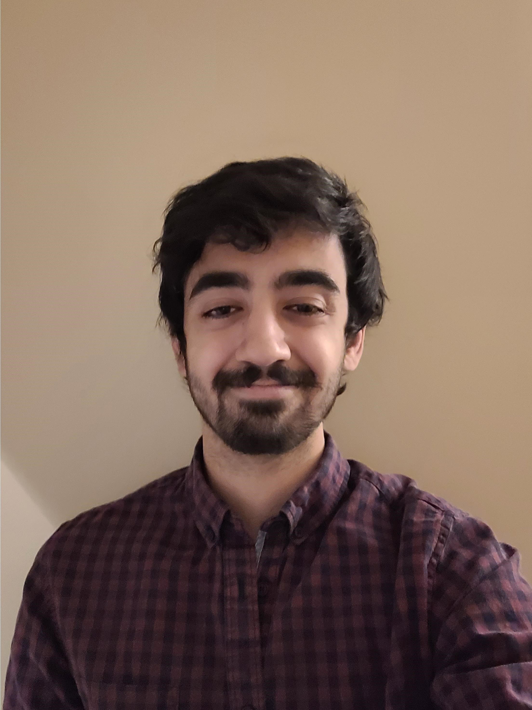

# Team Gr8

## Team Member Bios

 **Rachel Thevenard** is a graduate of UW’s Faculty of Environment with a Degree in ERS and a Diploma in Ecological Restoration and Rehabilitation. She is currently finishing a Diploma of Excellence in GIS. She spends her free time growing more sweet potatoes than she can eat, playing music, and drawing. 

 **Matthew Devine** is a graduate of the University of Waterloo's Faculty of Environment with a degree in Environment and Business and a Diploma in Ecological Restoration and Rehabilitation. He is currently finishing a Diploma of Excellence in GIS. Matthew is an avid boulderer and likes to build computers in his free time. 