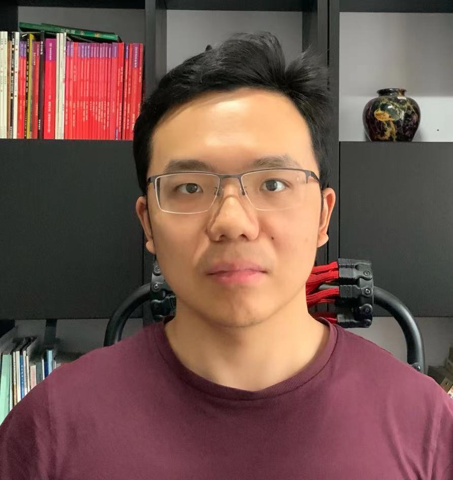
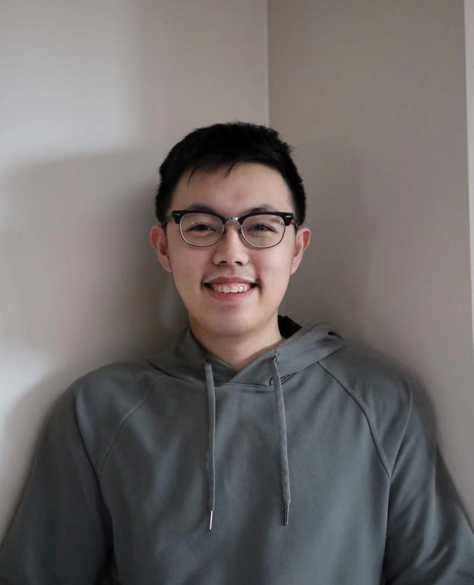
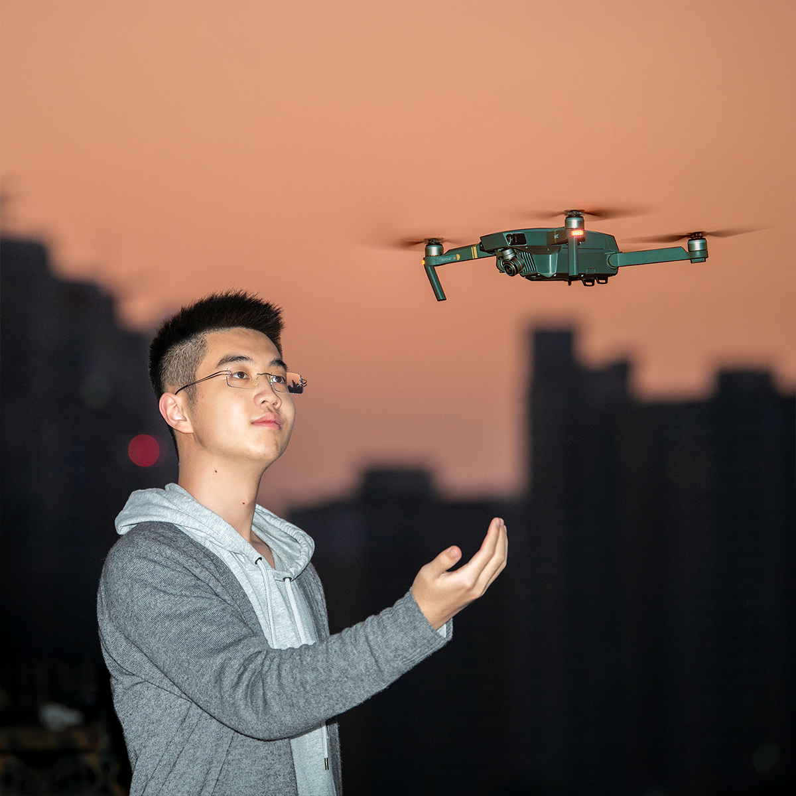

# Team Hedgehog

## Team Member Bios

 **Bizhe Bai**: I am a fourth-year student at the University of Toronto Mississauga. My interest's area is related to machine learning, parallel programming, computer vision. 

 **Yongzhao (Devin) Wu**: I am a third-year student at the University of Toronto Mississauga studying GIS and CS. I am interested in Web development and GIS development. I enjoy finding the GIS technology around me and see how GIS innovated our life. 

 **Haoxuan (Peter) Ge**: I am a second-year student studying Geography Information Science, Statistics, and Computer Science at the University of Toronto Mississauga. I am exploring the possibilities of GIS in public transportation and daily life. I also enjoy photography and playing musical keyboards during my leisure. 
