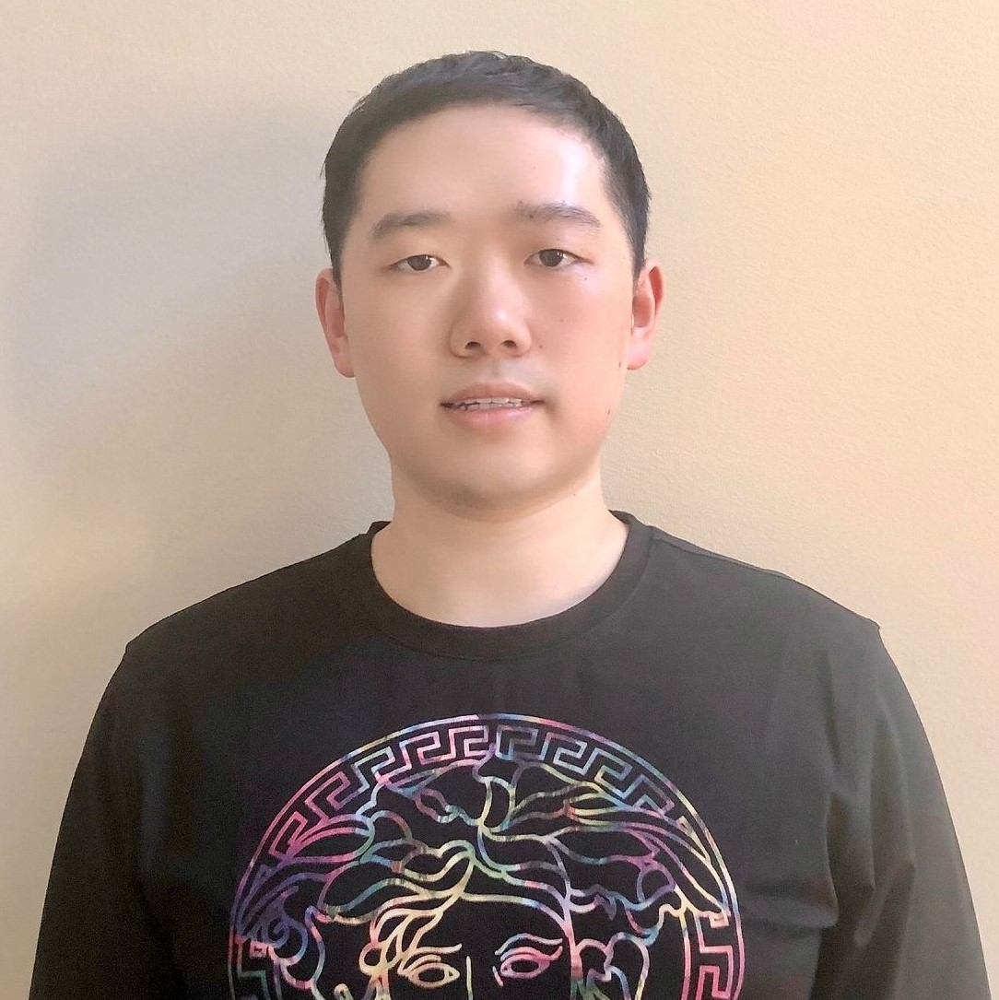

# The Equalizers

## Team Member Bios

 **Daniel Van Veghel**: I am a fourth year Bachelor of Arts & Science student at McMaster and have significant interests in Urban Planning, as well as Travel Behaviour and Transportation Geography. My undergraduate thesis has been exploring downtown revitalization in my hometown to combat urban sprawl development on the city’s periphery. I am nearing completion of my GIS Certificate through the School of Earth, Environment and Society at Mac and am excited to use all of the skills learned in courses from desktop and online applications of ArcGIS, in my first App Challenge experience! 

 **Andrew Koberstadt**: I am a 5th year undergraduate student in the Honours Environmental Science Co-op program while also pursuing a certificate in GIS. I have a huge interest in GIS and its applications in environmental modelling and sustainable future developments. The App Challenges provides an opportunity to challenge myself and apply all the skills I’ve learned throughout the years. I am also looking for a way to distinguish myself from others and the App Challenge is the perfect way to do that! Additionally, I enjoy playing sports and spending time outside. 

 **Junli Hu**: Currently, I am completing my last year of Honours Earth & Environmental Science Co-op Program with GIS specialization. I have a strong interest in GIS, Urban Planning, Hydrogeology and Environmental Assessment. I am planning to pursue the GIS Professional (GISP) certification. I have a good knowledge of Raster and Vector GIS, Advances in Geospatial Techniques, GIS Programming, Remote Sensing and Statistical Analysis. My independent study project used ArcGIS CityEngine for geodesign on McMaster Campus. Besides, I have gained extensive experience in GIS mapping and geoprocessing through the academic and co-op work terms. 