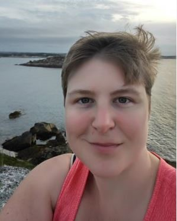
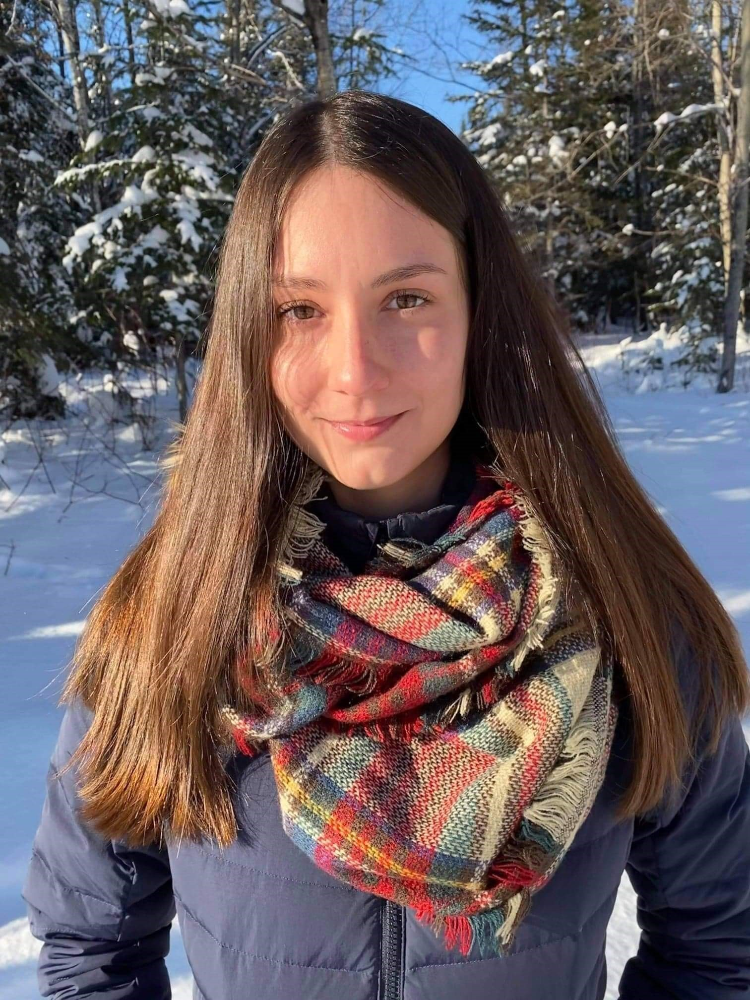
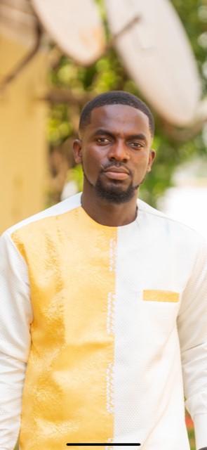

# The Equalizers

## Team Member Bios

 **Heidi Harding** is a second year Master of Science in Forestry student. Her research is looking at the availability and usage of nesting habitat by cavity-nesting ducks in the lower Wolastoq (Saint John) River floodplain. GIS is an integral part of her research, allowing her to identify suitable forest habitat and habitat-level characteristics that may help determine nesting habitat use. Her research is supported by Ducks Unlimited Canada, who will use her results to help inform management and conservation actions. She has a background in biology, education, and technology training, and enjoys reading, painting, and gardening in her free time. 

 **Kamille Lemieux** is a first year Master of Science in Forestry student. Her research is on LiDAR-based potato crop suitability mapping along the Upper Saint John River Valley in New Brunswick. This project will hopefully improve New Brunswick's food security strategy, especially in terms of expanding farming activities across forested lands deemed most suitable and accessible for farming. She chose a research project that will allow her to learn and apply new and existing GIS skills. During her free time, Kamille enjoys doing outdoor activities such as snowboarding, snowshoeing, kayaking, and gardening. 

 **Nana Agyei Owusu Afriyie**: I am an international student from Ghana, currently in my first year in a Master of Science in Forestry program at UNB. My current research work involves using geospatial data in hydrological modelling on forest supply roads in New Brunswick. I have a background In Natural Resource Management and Environmental Science and my previous research work involved using remote sensing and GIS for wildlife management. This is my first time being an ECCE associate and I am very excited about the opportunities that come with learning new ESRI courses and being part of the seminars. Outside of class, I spend time playing basketball and listening to music. 