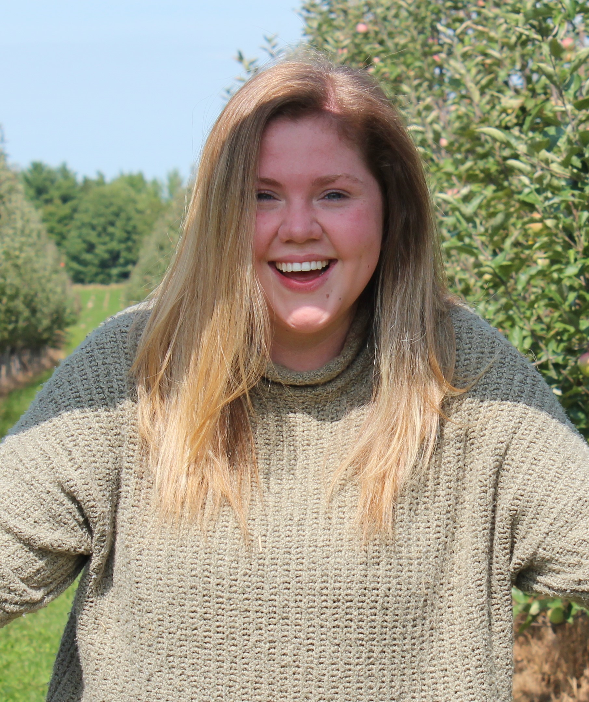
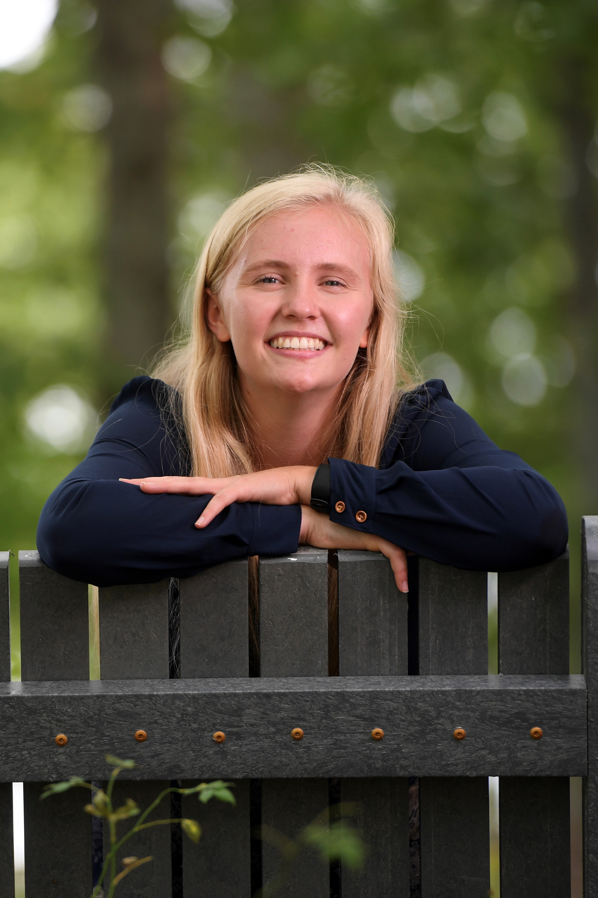
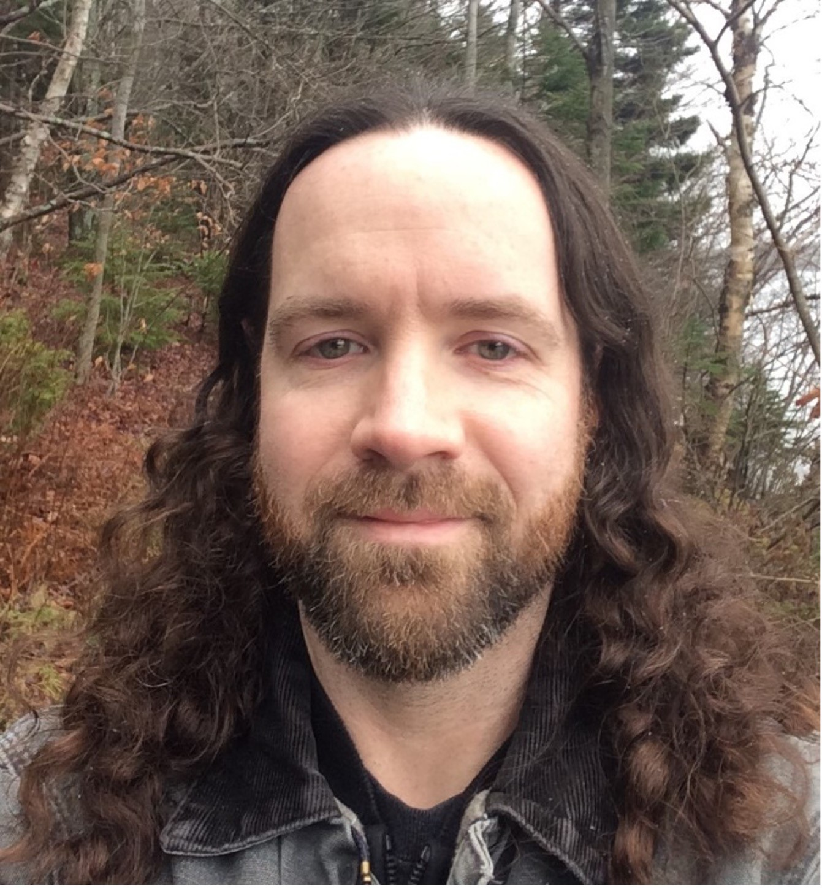

# The Legends

## Team Member Bios

 **Megan Haley**: I am a fourth year student completing a combined honours in Environmental Science and Environment, Sustainability, and Society at Dalhousie University. I am passionate about protecting the environment, and how we can re-establish our connection with the natural world. I believe GIS is a fantastic tool for making the outdoors accessible, highlighting inequalities in access to green space, and connecting technology with natural sciences through nature interpretation. 

 **Nina Garrett**: I am in my fourth year of a combined honours in Environmental Science and Environment, Sustainability and Society (ESS) at Dalhousie University. I am passionate about wildlife conservation and exploring the intersectionality between conservation and social systems. Over the course of my degree, I have come to appreciate the analytical power of GIS and its potential to communicate the environmental challenges we face. 

 **Nicolas Beauchamp**: I am a fourth year student at Dalhousie University studying Environmental Science and Environment, Sustainability and Society (ESS). My academic goals include completing my Undergraduate degree with a focus on GIS Management and Remote Sensing. When I am not mapping, I am collecting vinyl records or embarking on nature excursions along my favourite lakes year my home city of Dartmouth, Nova Scotia. 