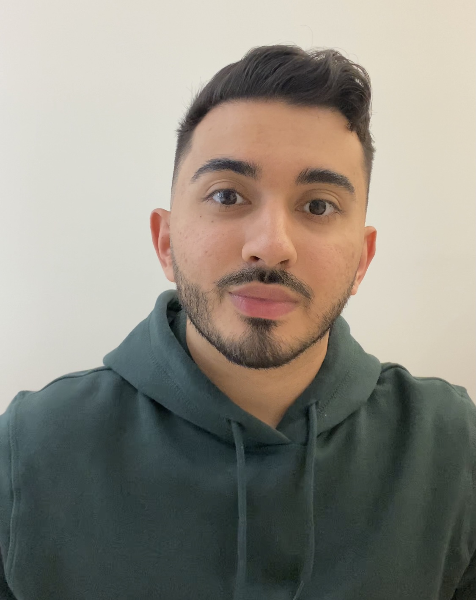

# Titans East

## Team Member Bios

 **Tianqi Qu** is a 2nd year undergraduate student at McMaster University studying Earth and Environmental Sciences and GIS. Currently working as a junior environmental scientist at CEPro Energy and Environmental Services Inc. with sound experience of field work and project management. Her interest in GIS was sparked by Patrick DeLuca in her first year at Mac, and she is pursuing a certificate in GIS. She loves to spend her spare time on road trips, hiking and baking. 

 **Venora Jin** is a 4th year student at McMaster University studying Biology and Geographic Information System. Venora is also interested in ecology and hoping to contribute to habitat conservation in the future. She loves listening to music and snowboarding. 

 **Farbod Tabaei** is a 4th year undergraduate student of Environmental studies at McMaster University while pursuing a degree in GIS. Farbod is also interested in sustainable practices and looks forward to specializing in climate change studies with a focus on sustainability and impact adaptations. His favourite hobbies are skiing and video games. 