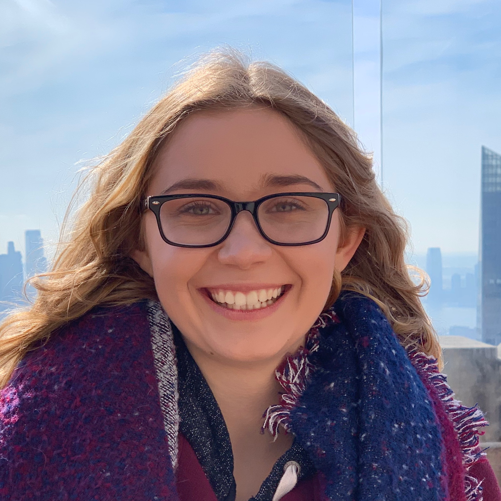
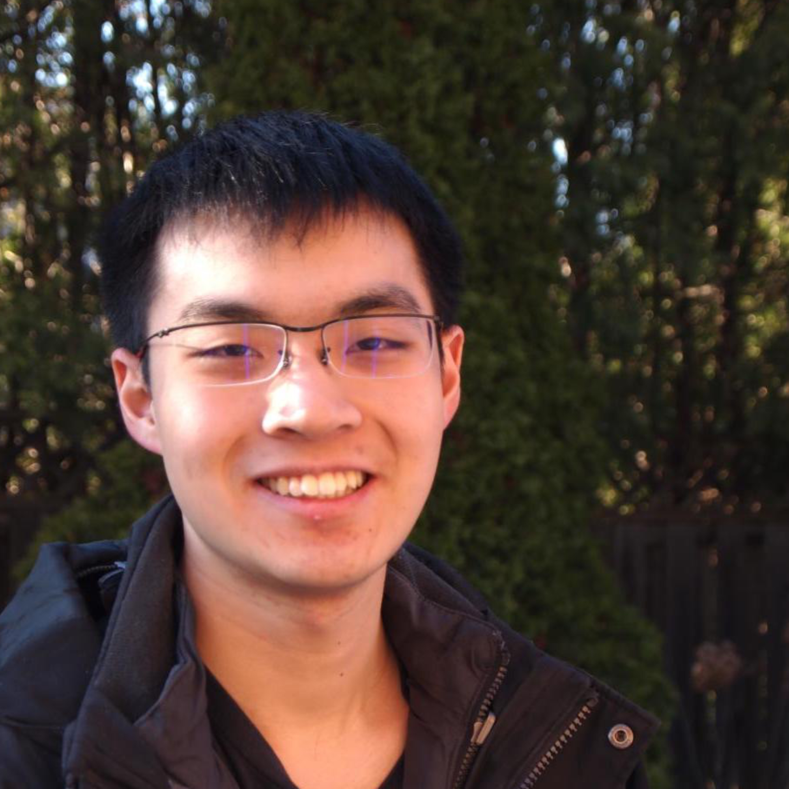
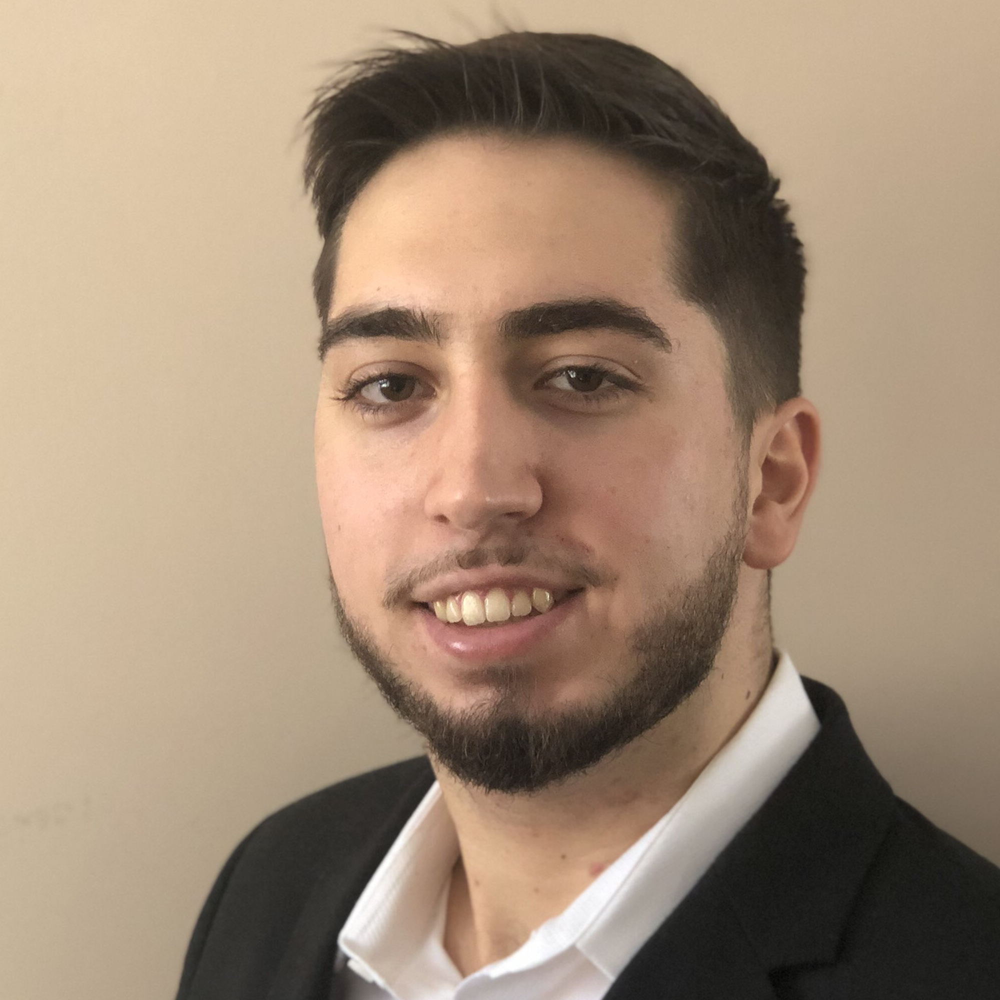

# UTM Zone 17N

## Team Member Bios

 **Scarlett Rakowska**: Hi, I’m Scarlett and I am in my fourth year of completing an Honours Bachelor of Science at the University of Toronto Mississauga. I am doing a double major in Geographical Information Systems (GIS) and Communication, Culture Information, and Technology (CCIT). In my free time, I love travelling and enjoying the outdoors. My current research examines the green space accessibility for students in Ontario elementary schools using GIS and Remote Sensing. 

 **Ryan Wong**: Hi, my name is Ryan. I enjoy making music, playing the trumpet, and creating useful mobile apps. My passion for teaching and computers has led me to love GIS because of the opportunity to take data, transform it, and present it in the form of elegant thematic maps. I am in my 4th year at University of Toronto Mississauga studying GIS, Communication Technology, and Computer Science. 

 **Nikola Malesevic**: Hello, my name is Nikola Malesevic. I am a fourth-year student at the University of Toronto majoring in Communication, Culture, Information Technology with two minors in geography including GIS. In my free time, I like to spend time outdoors, exploring new places and playing sports. A fun fact about me is that I can speak five languages. 
