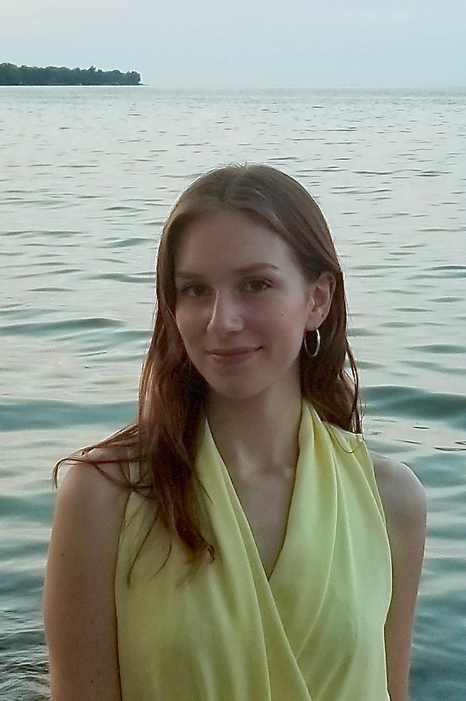
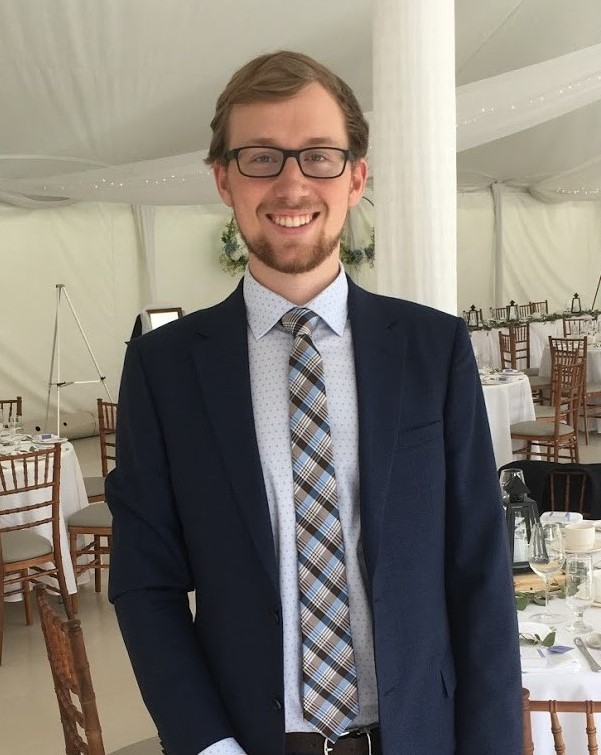

# Waterloo Health Organization (WHO)

## Team Member Bios

 **Claire Barker-Sharp** is a fourth-year undergraduate student at the University of Waterloo’s School of Planning. She is currently working towards completing a Bachelor of Environmental Studies in Honours Urban Planning, with a Diploma of Excellence in Geographic Information Systems and a Diploma in Sustainability. She has a strong interest in environmentalism and urban studies, and hopes to become a specialist in a field that incorporates the two. She conducted GIS related tasks such as app development and data cleaning. 

 **Jessica Vieira** is a fourth-year undergraduate student in the School of Planning at the University of Waterloo. She conducted the research and writing for this project. 

 **Logan Duff-Meadwell** is a second year Master student in the Geography and Environmental Management department at the University of Waterloo. His research focuses on the government adoption of AR and VR as civic technologies, along with this technology’s role and future in citizen-government processes. For the app challenge, he created the pitch video, conducted research and provided the French translation. 