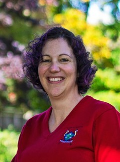

# mAPPers

## Team Member Bios

 **Alyssa Edwards**: Originally from Manitoba, I am currently a student taking the Advanced GIS Diploma at Center of Geographic Sciences, Nova Scotia Community College. I thoroughly enjoy learning about GIS and how it can be used to solve problems across multiple sectors. I graduated from the University of Manitoba with a B.A. in Geography. Outside of school I enjoy sewing and other crafts as well as camping in the summer. 

 **Abigail Mitchell**: Born and raised in Halifax, Nova Scotia, I am currently enrolled in the Advanced Diploma in GIS at the Centre of Geographic Sciences (COGS). I have a background in Biology, with a focus in Landscape Ecology as it relates to Agricultural Landscapes. I am enjoying my time expanding my knowledge in GIS as I am passionate about learning and collaborating with others. In my spare time I love being outdoors, especially by the ocean, while spending time with friends. 

 **Lisa Arblaster**: Originally from Ontario, I am currently enrolled in the Advanced Diploma in GIS at the Centre of Geographic Sciences, NSCC. I have a background in meteorology and environmental sciences and am passionate about using geomatics to learn new things, solve problems and share knowledge. I am also a huge animal lover and have been working with horses since childhood. In my free time, I am an avid outdoors person and love hiking and biking. 